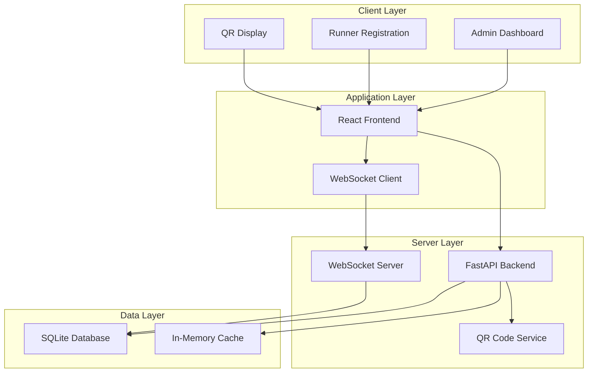

# Design Document

## Overview

The Runner Attendance Tracker is a web-based application built with a modern tech stack to handle real-time attendance tracking for a university social runner's club. The system uses a React frontend with WebSocket connections for real-time updates, a Python/FastAPI backend with SQLite for data persistence, and integrates QR code generation for seamless check-ins.

The architecture prioritizes simplicity, reliability, and performance under peak load (100 concurrent users), with real-time data synchronization and administrative ease of use. The system is designed as a single-page application with distinct interfaces for administrators and runners, leveraging Python's robust ecosystem and SQLite's reliability for a maintenance-free database solution.

## Architecture

### System Architecture



### Technology Stack

- **Frontend**: React 18 with TypeScript, Socket.IO client for real-time updates
- **Backend**: Python with FastAPI, Socket.IO for WebSocket connections
- **Database**: SQLite for persistent data storage (file-based, zero-configuration)
- **ORM**: SQLAlchemy with Alembic for database migrations
- **Cache**: In-memory caching with optional Redis for scaling
- **QR Generation**: Python qrcode library for generating unique QR codes
- **Deployment**: Free hosting options with Railway/Render for backend, Vercel for frontend

## Components and Interfaces

### Frontend Components

#### Admin Dashboard Component
- **Purpose**: Calendar configuration and attendance monitoring
- **Key Features**:
  - Interactive calendar for marking run days
  - Real-time attendance counter
  - Historical data visualization
  - Data export functionality
- **State Management**: React Context for global state, local state for UI interactions

#### Runner Registration Component
- **Purpose**: Quick attendance registration via QR code scan
- **Key Features**:
  - Simple form with name input
  - Duplicate registration prevention
  - Success/error feedback
  - Mobile-optimized interface
- **Performance**: Optimized for quick load times on mobile devices

#### QR Display Component
- **Purpose**: Display QR codes for administrators to project/print
- **Key Features**:
  - Large, scannable QR code display
  - Run date and session information
  - Print-friendly layout
  - Auto-refresh for daily codes

### Backend Services

#### Calendar Service
- **Responsibilities**:
  - Manage run day configuration
  - Generate unique session IDs for each run
  - Validate run day status
- **API Endpoints**:
  - `GET /api/calendar` - Retrieve calendar configuration
  - `POST /api/calendar/configure` - Update run day settings
  - `GET /api/calendar/today` - Check if today is a run day

#### Registration Service
- **Responsibilities**:
  - Process attendance registrations
  - Prevent duplicate registrations
  - Emit real-time updates
- **API Endpoints**:
  - `POST /api/register` - Register attendance
  - `GET /api/attendance/today` - Get current day attendance
  - `GET /api/attendance/history` - Get historical data

#### QR Code Service
- **Responsibilities**:
  - Generate unique QR codes for each run session
  - Validate QR code authenticity
  - Handle QR code expiration
- **API Endpoints**:
  - `GET /api/qr/:sessionId` - Generate QR code for session
  - `GET /api/qr/validate/:token` - Validate QR code token

## Data Models

### Database Schema (SQLite)

#### runs Table
```sql
CREATE TABLE runs (
    id INTEGER PRIMARY KEY AUTOINCREMENT,
    date DATE NOT NULL UNIQUE,
    session_id VARCHAR(255) NOT NULL UNIQUE,
    is_active BOOLEAN DEFAULT 1,
    created_at DATETIME DEFAULT CURRENT_TIMESTAMP
);
```

#### attendances Table
```sql
CREATE TABLE attendances (
    id INTEGER PRIMARY KEY AUTOINCREMENT,
    run_id INTEGER REFERENCES runs(id) ON DELETE CASCADE,
    runner_name VARCHAR(255) NOT NULL,
    registered_at DATETIME DEFAULT CURRENT_TIMESTAMP,
    UNIQUE(run_id, runner_name)
);
```

#### calendar_config Table
```sql
CREATE TABLE calendar_config (
    id INTEGER PRIMARY KEY AUTOINCREMENT,
    date DATE NOT NULL UNIQUE,
    has_run BOOLEAN NOT NULL,
    updated_at DATETIME DEFAULT CURRENT_TIMESTAMP
);
```

### Python Data Models (Pydantic/SQLAlchemy)

#### Run Model
```python
class Run(Base):
    __tablename__ = "runs"
    
    id = Column(Integer, primary_key=True, index=True)
    date = Column(Date, nullable=False, unique=True, index=True)
    session_id = Column(String(255), nullable=False, unique=True, index=True)
    is_active = Column(Boolean, default=True, nullable=False)
    created_at = Column(DateTime, default=datetime.utcnow, nullable=False)
    
    attendances = relationship("Attendance", back_populates="run", cascade="all, delete-orphan")
```

#### Attendance Model
```python
class Attendance(Base):
    __tablename__ = "attendances"
    
    id = Column(Integer, primary_key=True, index=True)
    run_id = Column(Integer, ForeignKey("runs.id", ondelete="CASCADE"), nullable=False, index=True)
    runner_name = Column(String(255), nullable=False, index=True)
    registered_at = Column(DateTime, default=datetime.utcnow, nullable=False)
    
    run = relationship("Run", back_populates="attendances")
```

### Data Transfer Objects (Pydantic Schemas)

#### RegistrationRequest
```python
class RegistrationRequest(BaseModel):
    session_id: str = Field(..., min_length=1, max_length=255)
    runner_name: str = Field(..., min_length=1, max_length=255)
    timestamp: datetime = Field(default_factory=datetime.utcnow)
```

#### AttendanceResponse
```python
class AttendanceResponse(BaseModel):
    success: bool
    message: str
    current_count: int
    runner_name: Optional[str] = None
```

#### CalendarDay
```python
class CalendarDay(BaseModel):
    date: str = Field(..., description="ISO date string (YYYY-MM-DD)")
    has_run: bool
    attendance_count: Optional[int] = None
    session_id: Optional[str] = None
```

## Error Handling

### Client-Side Error Handling
- **Network Errors**: Retry mechanism with exponential backoff
- **Validation Errors**: Real-time form validation with user-friendly messages
- **WebSocket Disconnection**: Automatic reconnection with connection status indicator

### Server-Side Error Handling
- **Database Errors**: Transaction rollback and error logging
- **Duplicate Registration**: Return appropriate HTTP status with clear message
- **Rate Limiting**: Implement rate limiting to prevent abuse during peak times
- **QR Code Validation**: Secure token validation with expiration checks

### High Load Scenarios
- **Connection Pooling**: Database connection pooling for efficient resource usage
- **Caching Strategy**: Redis caching for frequently accessed data
- **Load Balancing**: Horizontal scaling capability with session affinity
- **Circuit Breaker**: Prevent cascade failures during system stress

## Testing Strategy

### Unit Testing
- **Frontend**: Jest and React Testing Library for component testing
- **Backend**: Pytest for service and utility function testing with comprehensive fixtures
- **Database**: In-memory SQLite database with seed data for repository testing

### Integration Testing
- **API Testing**: FastAPI TestClient for endpoint testing with test database
- **WebSocket Testing**: Python-socketio client testing for real-time functionality
- **QR Code Flow**: End-to-end testing of QR generation and validation

### Performance Testing
- **Load Testing**: Locust or Artillery.js to simulate 100 concurrent registrations
- **Database Performance**: SQLite query optimization and index testing
- **WebSocket Scalability**: Test real-time updates under load

### End-to-End Testing
- **User Workflows**: Playwright for complete user journey testing
- **Cross-Browser**: Testing on mobile and desktop browsers
- **Peak Load Simulation**: Automated testing of first-day scenario (100 users)

## Deployment and Hosting

### Free Hosting Strategy

#### Frontend Hosting (Vercel)
- **Cost**: Free tier supports unlimited personal projects
- **Features**: Automatic deployments from Git, global CDN, custom domains
- **Limits**: 100GB bandwidth/month, sufficient for university club usage
- **Setup**: Connect GitHub repository for automatic deployments

#### Backend Hosting Options

**Option 1: Railway (Recommended)**
- **Cost**: Free tier available, $5/month for additional resources
- **Features**: Automatic deployments, persistent file storage, environment management
- **Limits**: 500 hours/month execution time on free tier
- **Benefits**: SQLite database file persists across deployments, no external database needed

**Option 2: Render**
- **Cost**: Free tier available
- **Database**: SQLite file stored in persistent volume
- **Limits**: 750 hours/month, sleeps after 15 minutes of inactivity
- **Considerations**: May have cold start delays, need persistent disk for SQLite

**Option 3: PythonAnywhere**
- **Cost**: Free tier with 100 seconds/day CPU time
- **Database**: SQLite file in user directory
- **Benefits**: Python-focused hosting, persistent file storage included
- **Limitations**: CPU time restrictions on free tier

### Recommended Free Setup
1. **Frontend**: Deploy React app to Vercel (free)
2. **Backend**: Deploy Python/FastAPI to Railway free tier
3. **Database**: SQLite file stored on Railway's persistent storage
4. **Monitoring**: Use Railway's built-in logging and metrics

### Production Considerations
- **Domain**: Use free subdomain initially, upgrade to custom domain later
- **SSL**: Automatic HTTPS on both Vercel and Railway
- **Backups**: Railway includes automatic database backups
- **Scaling**: Can upgrade Railway plan if usage exceeds free tier limits

## Security Considerations

### QR Code Security
- **Token Expiration**: QR codes expire after 24 hours
- **Session Validation**: Server-side validation of all QR code tokens
- **Rate Limiting**: Prevent QR code generation abuse

### Data Protection
- **Input Sanitization**: All user inputs sanitized and validated
- **SQL Injection Prevention**: Parameterized queries and ORM usage
- **CORS Configuration**: Proper CORS setup for production deployment

### Performance Security
- **DDoS Protection**: Rate limiting and request throttling
- **Resource Limits**: Memory and CPU usage monitoring
- **Database Security**: Connection encryption and access controls