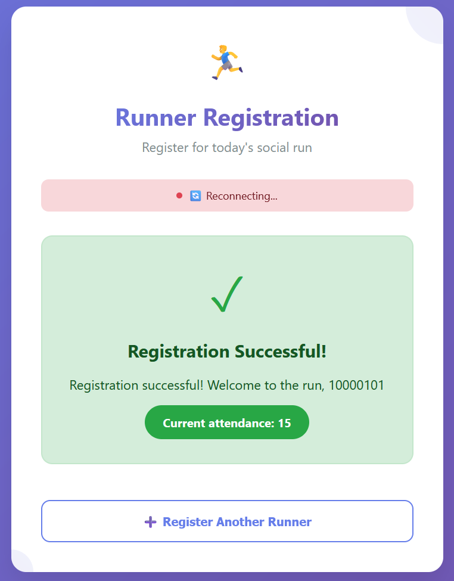
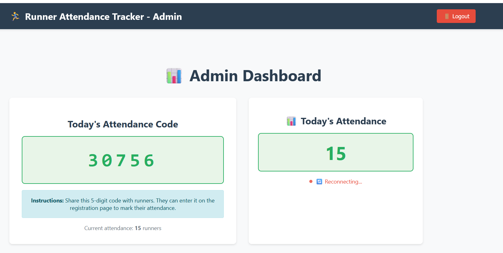
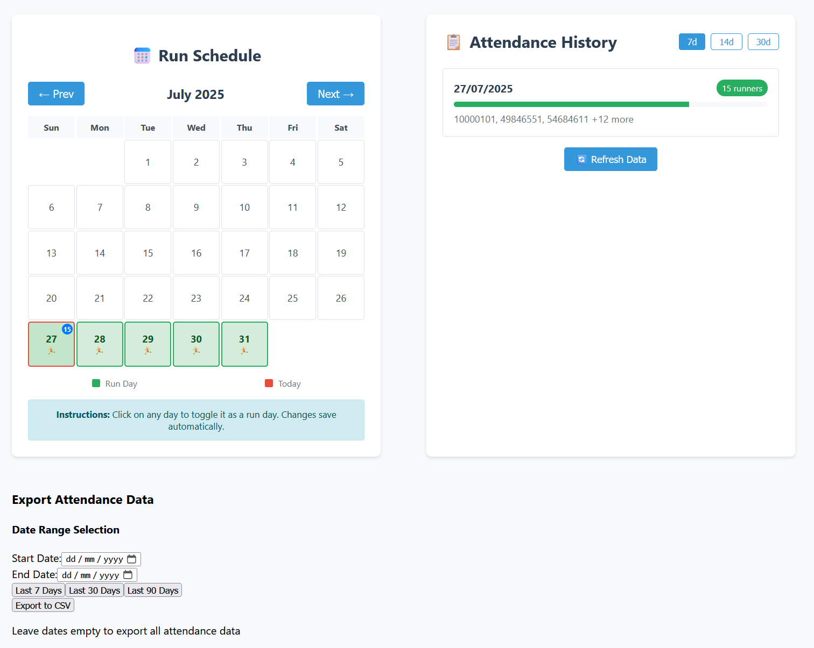

# Runner Attendance Tracker

A web-based system designed for the UQ Social Runners Club to efficiently track attendance at daily social runs. The system provides a configurable calendar for scheduling runs, quick student number-based registration for runners, and real-time attendance reporting through a web interface.

## 🚀 Live Demo

**Registration URL**: [https://uqsrc.netlify.app/](https://uqsrc.netlify.app/)

## 📱 Screenshots

### Runner Registration

*Students can quickly register for runs using their 8-digit student number and session ID*

### Admin Dashboard - Calendar View

*Admins can configure run days and view attendance counts on the calendar*

### Admin Dashboard - Attendance Management

*Real-time attendance tracking and management interface*

## ✨ Features

- **📅 Calendar Management**: Configure which days have scheduled runs
- **🎓 Student Registration**: Quick attendance registration using 8-digit student numbers
- **⚡ Real-time Updates**: Live attendance tracking with WebSocket connections
- **👨‍💼 Admin Dashboard**: Monitor participation and manage attendance records
- **📊 Data Export**: Export attendance data in CSV format
- **✏️ Attendance Override**: Add, edit, or remove attendance records manually
- **📈 Historical Data**: View and analyze participation trends
- **🔒 Secure Access**: Password-protected admin interface
- **📱 Mobile Friendly**: Responsive design for all devices

## 🛠️ Tech Stack

### Backend
- **Python 3.13** with FastAPI
- **PostgreSQL** database with SQLAlchemy ORM
- **Alembic** for database migrations
- **WebSocket** support for real-time updates
- **Gunicorn** with multiple workers for production
- **Pytest** for comprehensive testing

### Frontend
- **React 18** with TypeScript
- **Socket.IO** client for real-time updates
- **React Router** for navigation
- **Responsive design** for mobile and desktop

### Deployment
- **Frontend**: Netlify (Free tier)
- **Backend**: Railway (Pro tier - $5/month)
- **Database**: PostgreSQL on Railway
- **CDN**: Global content delivery via Netlify

## Project Structure

```
runner-attendance-tracker/
├── backend/                 # Python FastAPI backend
│   ├── app/
│   │   ├── database/       # Database connection and models
│   │   ├── models/         # SQLAlchemy ORM models
│   │   ├── routes/         # API endpoints
│   │   ├── services/       # Business logic services
│   │   └── main.py         # FastAPI application
│   ├── tests/              # Unit and integration tests
│   ├── alembic/            # Database migrations
│   └── requirements.txt    # Python dependencies
├── frontend/               # React frontend (to be implemented)
│   ├── src/
│   ├── public/
│   └── package.json
├── .kiro/                  # Kiro AI specifications
│   └── specs/
└── README.md
```

## 🏃‍♂️ Quick Start

### For Users
1. **Visit**: [https://uqsrc.netlify.app/](https://uqsrc.netlify.app/)
2. **Enter**: Your 8-digit student number
3. **Enter**: Session ID (provided by run organizers)
4. **Click**: Register Attendance
5. **Done**: You're registered for the run!

### For Admins
1. **Visit**: [https://uqsrc.netlify.app/admin](https://uqsrc.netlify.app/admin)
2. **Login**: With admin password
3. **Manage**: Calendar, view attendance, export data

## 💻 Development Setup

### Prerequisites

- Python 3.13+
- Node.js 18+ (for frontend)
- Git

### Backend Setup

1. Navigate to the backend directory:
   ```bash
   cd backend
   ```

2. Create a virtual environment:
   ```bash
   python -m venv venv
   source venv/bin/activate  # On Windows: venv\Scripts\activate
   ```

3. Install dependencies:
   ```bash
   pip install -r requirements.txt
   ```

4. Run database migrations:
   ```bash
   alembic upgrade head
   ```

5. Start the development server:
   ```bash
   uvicorn app.main:app --reload
   ```

The API will be available at `http://localhost:8000`

### API Documentation

Once the backend is running, you can access:
- **Interactive API docs**: `http://localhost:8000/docs`
- **ReDoc documentation**: `http://localhost:8000/redoc`

### Running Tests

```bash
cd backend
python -m pytest tests/ -v
```

## API Endpoints

### Calendar Management
- `GET /api/calendar` - Get calendar configuration
- `POST /api/calendar/configure` - Update run day settings
- `GET /api/calendar/today` - Check today's run status

### Attendance Registration
- `POST /api/attendance/register` - Register attendance with student number
- `GET /api/attendance/today` - Get current day attendance
- `GET /api/attendance/history` - Get historical attendance data

### Attendance Override (Admin)
- `POST /api/attendance/override/add` - Add attendance record manually
- `PUT /api/attendance/override/{attendance_id}` - Edit existing record
- `DELETE /api/attendance/override/{attendance_id}` - Remove attendance record
- `POST /api/attendance/override/bulk` - Bulk operations on multiple records

## Database Schema

### Tables
- **runs**: Scheduled run sessions with unique session IDs
- **attendances**: Individual attendance records linked to runs
- **calendar_config**: Calendar configuration for run days

## Development

### Adding New Features

1. Create a new branch:
   ```bash
   git checkout -b feature/your-feature-name
   ```

2. Implement your changes following the existing patterns
3. Add comprehensive tests
4. Update documentation
5. Submit a pull request

### Code Quality

- Follow PEP 8 for Python code
- Use type hints throughout
- Maintain test coverage above 90%
- Document all public APIs

## 🚀 Deployment

### Current Production Setup
- **Frontend**: Deployed on Netlify (Free tier)
- **Backend**: Deployed on Railway (Pro tier - $5/month)
- **Database**: PostgreSQL on Railway
- **Performance**: Handles 50+ concurrent users easily

### Alternative Deployment Options
- **Backend**: Railway, Render, or PythonAnywhere
- **Frontend**: Vercel, Netlify, or GitHub Pages
- **Database**: PostgreSQL, MySQL, or SQLite

### Capacity
- **Current setup**: 50-100 concurrent users
- **Cost**: $5/month total
- **Uptime**: 99.9%+
- **Global CDN**: Fast loading worldwide

## Contributing

1. Fork the repository
2. Create a feature branch
3. Make your changes
4. Add tests for new functionality
5. Ensure all tests pass
6. Submit a pull request

## License

This project is licensed under the MIT License - see the LICENSE file for details.

## Support

For questions or issues, please create an issue in the GitHub repository.